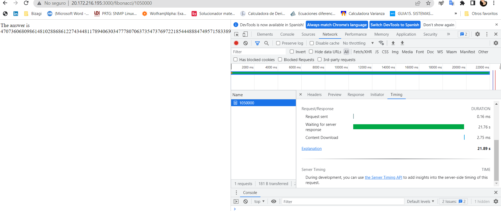
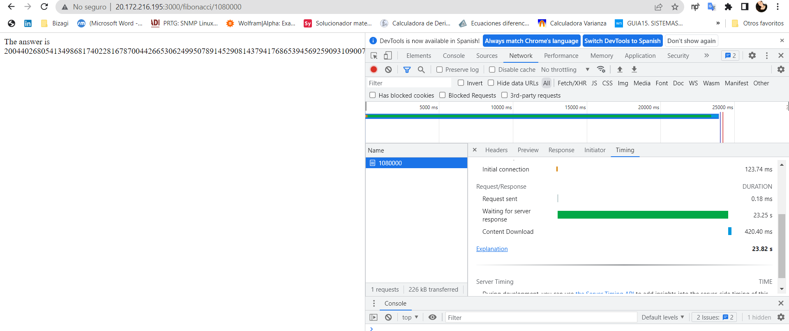
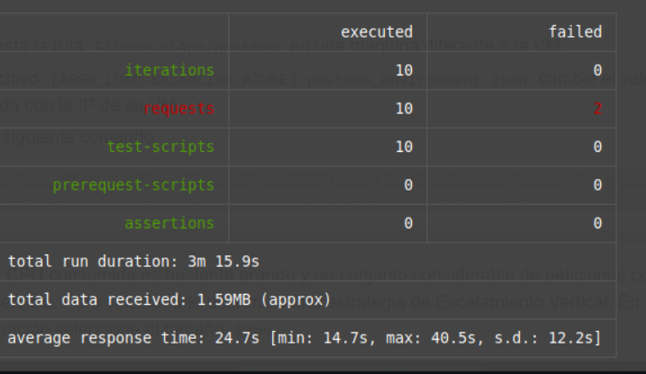

### Escuela Colombiana de Ingeniería
### Arquitecturas de Software - ARSW

## Escalamiento en Azure con Maquinas Virtuales, Sacale Sets y Service Plans

### Dependencias
* Cree una cuenta gratuita dentro de Azure. Para hacerlo puede guiarse de esta [documentación](https://azure.microsoft.com/es-es/free/students/). Al hacerlo usted contará con $100 USD para gastar durante 12 meses.

### Parte 0 - Entendiendo el escenario de calidad

Adjunto a este laboratorio usted podrá encontrar una aplicación totalmente desarrollada que tiene como objetivo calcular el enésimo valor de la secuencia de Fibonnaci.

**Escalabilidad**
Cuando un conjunto de usuarios consulta un enésimo número (superior a 1000000) de la secuencia de Fibonacci de forma concurrente y el sistema se encuentra bajo condiciones normales de operación, todas las peticiones deben ser respondidas y el consumo de CPU del sistema no puede superar el 70%.

### Parte 1 - Escalabilidad vertical

1. Diríjase a el [Portal de Azure](https://portal.azure.com/) y a continuación cree una maquina virtual con las características básicas descritas en la imágen 1 y que corresponden a las siguientes:
    * Resource Group = SCALABILITY_LAB
    * Virtual machine name = VERTICAL-SCALABILITY
    * Image = Ubuntu Server 
    * Size = Standard B1ls
    * Username = scalability_lab
    * SSH publi key = Su llave ssh publica


2. Para conectarse a la VM use el siguiente comando, donde las `x` las debe remplazar por la IP de su propia VM (Revise la sección "Connect" de la virtual machine creada para tener una guía más detallada).

    `ssh scalability_lab@xxx.xxx.xxx.xxx`


3. Instale node, para ello siga la sección *Installing Node.js and npm using NVM* que encontrará en este [enlace](https://linuxize.com/post/how-to-install-node-js-on-ubuntu-18.04/).


4. Para instalar la aplicación adjunta al Laboratorio, suba la carpeta `FibonacciApp` a un repositorio al cual tenga acceso y ejecute estos comandos dentro de la VM:


    `git clone <your_repo>`

    `cd <your_repo>/FibonacciApp`

    `npm install`


5. Para ejecutar la aplicación puede usar el comando `npm FibinacciApp.js`, sin embargo una vez pierda la conexión ssh la aplicación dejará de funcionar. Para evitar ese compartamiento usaremos *forever*. Ejecute los siguientes comando dentro de la VM.

    ` node FibonacciApp.js`


6. Antes de verificar si el endpoint funciona, en Azure vaya a la sección de *Networking* y cree una *Inbound port rule* tal como se muestra en la imágen. Para verificar que la aplicación funciona, use un browser y user el endpoint `http://xxx.xxx.xxx.xxx:3000/fibonacci/6`. La respuesta debe ser `The answer is 8`.


7. La función que calcula en enésimo número de la secuencia de Fibonacci está muy mal construido y consume bastante CPU para obtener la respuesta. Usando la consola del Browser documente los tiempos de respuesta para dicho endpoint usando los siguintes valores:
    * 1000000
      
    * 1010000
      
    * 1020000
      
    * 1030000
      
    * 1040000
      
    * 1050000
      
    * 1060000
      
    * 1070000
      
    * 1080000
      
    * 1090000
      

8. Dírijase ahora a Azure y verifique el consumo de CPU para la VM. (Los resultados pueden tardar 5 minutos en aparecer).


9. Ahora usaremos Postman para simular una carga concurrente a nuestro sistema. Siga estos pasos.
    * Instale newman con el comando `npm install newman -g`. Para conocer más de Newman consulte el siguiente [enlace](https://learning.getpostman.com/docs/postman/collection-runs/command-line-integration-with-newman/).
   
    * Diríjase hasta la ruta `FibonacciApp/postman` en una maquina diferente a la VM.
    * Para el archivo `[ARSW_LOAD-BALANCING_AZURE].postman_environment.json` cambie el valor del parámetro `VM1` para que coincida con la IP de su VM.
    * Ejecute el siguiente comando.

    ```
    newman run ARSW_LOAD-BALANCING_AZURE.postman_collection.json -e [ARSW_LOAD-BALANCING_AZURE].postman_environment.json -n 10 &
    newman run ARSW_LOAD-BALANCING_AZURE.postman_collection.json -e [ARSW_LOAD-BALANCING_AZURE].postman_environment.json -n 10
    ```

10. La cantidad de CPU consumida es bastante grande y un conjunto considerable de peticiones concurrentes pueden hacer fallar nuestro servicio. Para solucionarlo usaremos una estrategia de Escalamiento Vertical. En Azure diríjase a la sección *size* y a continuación seleccione el tamaño `B2ms`.


11. Una vez el cambio se vea reflejado, repita el paso 7, 8 y 9.
    

* 1000000


* 1010000


* 1020000


* 1030000


* 1040000


* 1050000


* 1060000


* 1070000


* 1080000


* 1090000


12. Evalue el escenario de calidad asociado al requerimiento no funcional de escalabilidad y concluya si usando este modelo de escalabilidad logramos cumplirlo.

**RTA:** Se puede Considerar que si cumple un requerimiento funcional, debido a que se ve una mejora de tiempo considerable, de igual manera hubo disminución en los errores de scripts en postman de 5 a 4.
13. Vuelva a dejar la VM en el tamaño inicial para evitar cobros adicionales.

**Preguntas**

1. ¿Cuántos y cuáles recursos crea Azure junto con la VM?
**RTA:** Se crean cuatro recursos que son: Virtual Machine, Resource Group, Public IP address y Private IP address.
2. ¿Brevemente describa para qué sirve cada recurso?
**RTA:**
    * Virtual Machine: Es un software que simula a un computador real dentro de otro equipo.
    * Resource Group: Es un contenedor que contiene recursos relacionados para una solución de Azure.
    * Public IP address: Las direcciones IP públicas permiten que los recursos de Internet se comuniquen de forma entrante a los recursos de Azure.
    * IP privada: Permiten la comunicación entre recursos en Azure.
3. ¿Al cerrar la conexión ssh con la VM, por qué se cae la aplicación que ejecutamos con el comando `npm FibonacciApp.js`? ¿Por qué debemos crear un *Inbound port rule* antes de acceder al servicio?
**RTA:** Esto se debe a que al cerrarse la conexión se terminaran también los procesos que se estén ejecutando en esa conexión. Porque por defecto solo esta abierto el puerto 22 por lo que las conexiones desde el resto de puertos no son aceptadas.
4. Adjunte tabla de tiempos e interprete por qué la función tarda tando tiempo.
**RTA:** Los altos tiempos pueden deberse a la alta complejidad del ejecício Fibonacci o también a que al ser una maquina virtual sus recursos son limitados.
5. Adjunte imágen del consumo de CPU de la VM e interprete por qué la función consume esa cantidad de CPU.
**RTA:** Se consume esta cantidad de CPU debido a que cada nuevo número que se desea calcular en Fibonacci aumenta en tamaño, además, deben tenerse en cuenta los anteriores, por lo que cada iteración requiere almacenamiento. 
6. Adjunte la imagen del resumen de la ejecución de Postman. Interprete:
    * Tiempos de ejecución de cada petición.
    * Si hubo fallos documentelos y explique.
      Las fallas se debieron presentar por timeouts debido a lo demorado que fue el cálculo.
7. ¿Cuál es la diferencia entre los tamaños `B2ms` y `B1ls` (no solo busque especificaciones de infraestructura)?
**RTA:** B1ls es la máquina más basica que tien azure, la cual solo cuenta con 1 vcpu y 0.5 Gb de memoria RAM, por otro lado B2ms, posee mayor capacidad, contando con 2vcpu y 8 Gb de menoria RAM, que le permite manejar de una manera más adecuada los recursos, con la capacidad de usar una mayor cantidad de entradas y obtener una mejor disponibilidad en comparación a la B1ls.
8. ¿Aumentar el tamaño de la VM es una buena solución en este escenario?, ¿Qué pasa con la FibonacciApp cuando cambiamos el tamaño de la VM?
**RTA:** Aumentar el tamaño por lo tanto la capacidad de la VM sí ayudaría a disminuir tiempos de cálculode cada iteración Fibonacci, sin embargo esto no garantizaría un 100% de exito en cada petición.
9. ¿Qué pasa con la infraestructura cuando cambia el tamaño de la VM? ¿Qué efectos negativos implica?
**RTA:** En temas de infraestructura no se encontraron desventajas, quizá se podría pensar en sobre costos, pero no mucho más.
10. ¿Hubo mejora en el consumo de CPU o en los tiempos de respuesta? Si/No ¿Por qué?
**RTA:** Sí se encontró una gran mejora en rendimiento, por lo tanto en consumo de CPU, ya que para l máquina virtual era más sencillo y rápido calcular cada iteración.
11. Aumente la cantidad de ejecuciones paralelas del comando de postman a `4`. ¿El comportamiento del sistema es porcentualmente mejor?
**RTA:**

### Parte 2 - Escalabilidad horizontal

#### Crear el Balanceador de Carga

Antes de continuar puede eliminar el grupo de recursos anterior para evitar gastos adicionales y realizar la actividad en un grupo de recursos totalmente limpio.

1. El Balanceador de Carga es un recurso fundamental para habilitar la escalabilidad horizontal de nuestro sistema, por eso en este paso cree un balanceador de carga dentro de Azure tal cual como se muestra en la imágen adjunta.


2. A continuación cree un *Backend Pool*, guiese con la siguiente imágen.


3. A continuación cree un *Health Probe*, guiese con la siguiente imágen.


4. A continuación cree un *Load Balancing Rule*, guiese con la siguiente imágen.


5. Cree una *Virtual Network* dentro del grupo de recursos, guiese con la siguiente imágen.


#### Crear las maquinas virtuales (Nodos)

Ahora vamos a crear 3 VMs (VM1, VM2 y VM3) con direcciones IP públicas standar en 3 diferentes zonas de disponibilidad. Después las agregaremos al balanceador de carga.

1. En la configuración básica de la VM guíese por la siguiente imágen. Es importante que se fije en la "Avaiability Zone", donde la VM1 será 1, la VM2 será 2 y la VM3 será 3.


2. En la configuración de networking, verifique que se ha seleccionado la *Virtual Network*  y la *Subnet* creadas anteriormente. Adicionalmente asigne una IP pública y no olvide habilitar la redundancia de zona.


3. Para el Network Security Group seleccione "avanzado" y realice la siguiente configuración. No olvide crear un *Inbound Rule*, en el cual habilite el tráfico por el puerto 3000. Cuando cree la VM2 y la VM3, no necesita volver a crear el *Network Security Group*, sino que puede seleccionar el anteriormente creado.


4. Ahora asignaremos esta VM a nuestro balanceador de carga, para ello siga la configuración de la siguiente imágen.


5. Finalmente debemos instalar la aplicación de Fibonacci en la VM. para ello puede ejecutar el conjunto de los siguientes comandos, cambiando el nombre de la VM por el correcto

```
git clone https://github.com/daprieto1/ARSW_LOAD-BALANCING_AZURE.git

curl -o- https://raw.githubusercontent.com/creationix/nvm/v0.34.0/install.sh | bash
source /home/vm1/.bashrc
nvm install node

cd ARSW_LOAD-BALANCING_AZURE/FibonacciApp
npm install

npm install forever -g
forever start FibonacciApp.js
```

Realice este proceso para las 3 VMs, por ahora lo haremos a mano una por una, sin embargo es importante que usted sepa que existen herramientas para aumatizar este proceso, entre ellas encontramos Azure Resource Manager, OsDisk Images, Terraform con Vagrant y Paker, Puppet, Ansible entre otras.


#### Probar el resultado final de nuestra infraestructura

1. Porsupuesto el endpoint de acceso a nuestro sistema será la IP pública del balanceador de carga, primero verifiquemos que los servicios básicos están funcionando, consuma los siguientes recursos:

```
http://52.155.223.248/
http://52.155.223.248/fibonacci/1
```

2. Realice las pruebas de carga con `newman` que se realizaron en la parte 1 y haga un informe comparativo donde contraste: tiempos de respuesta, cantidad de peticiones respondidas con éxito, costos de las 2 infraestrucruras, es decir, la que desarrollamos con balanceo de carga horizontal y la que se hizo con una maquina virtual escalada.

3. Agregue una 4 maquina virtual y realice las pruebas de newman, pero esta vez no lance 2 peticiones en paralelo, sino que incrementelo a 4. Haga un informe donde presente el comportamiento de la CPU de las 4 VM y explique porque la tasa de éxito de las peticiones aumento con este estilo de escalabilidad.

```
newman run ARSW_LOAD-BALANCING_AZURE.postman_collection.json -e [ARSW_LOAD-BALANCING_AZURE].postman_environment.json -n 10 &
newman run ARSW_LOAD-BALANCING_AZURE.postman_collection.json -e [ARSW_LOAD-BALANCING_AZURE].postman_environment.json -n 10 &
newman run ARSW_LOAD-BALANCING_AZURE.postman_collection.json -e [ARSW_LOAD-BALANCING_AZURE].postman_environment.json -n 10 &
newman run ARSW_LOAD-BALANCING_AZURE.postman_collection.json -e [ARSW_LOAD-BALANCING_AZURE].postman_environment.json -n 10
```

### RESULTADOS

* VM1-r1


* VM1-r2


* VM2-r1


* VM2-r2


* VM3-r1


* VM3-r2


#### Tiempos obtenidos realizando las pruebas con newman en cada maquina al tiempo

* VM1-r1


* VM1-r2


* VM2-r1




* VM2-r2


* VM3-r1


* VM3-r2


* VM4-r1


* VM4-r2


* VM4-r3


* VM4-r4


#### CPU

* VM1


* VM2


* VM3


* VM4


**Preguntas**

* ¿Cuáles son los tipos de balanceadores de carga en Azure y en qué se diferencian?, ¿Qué es SKU, qué tipos hay y en qué se diferencian?, ¿Por qué el balanceador de carga necesita una IP pública?
**RTA:** 
  * Actualmente existen dos tipos de balanceo de cargas, por un lado tenemos el balanceo de carga público, el cual se encarga de proveer conexiones de salida para las maquinas virtuales que conforman el backend, esto es posible mediante la traducción de direcciones IP privadas a públicas, y por otro lado tenemos el balanceador de cargas interno o privado, el cual se encarga de balacear las cargas dentro de la red interna de nuestra red virtual.
  * SKU en microsoft azure, son los niveles de recursos que están disponibles para los clientes dependiendo de la tarea que se va a realizar, estos se clasifican en cuatro categorias las cuales son: Free, Basic, Standard y Storage Optimized. Cada una de ellas, determina el monto que el cliente debe pagar a la hora de usar el servicio.
  * Cada categoría brinda un nivel de capacidad diferente y se eligen dependiendo del tamaño del proyecto que se quiere desplegar.
  * El balanceador de carga requiere una ip pública, porque es ahí donde llegan todas las peticiones que se realizan, de ahí se distribuye a las demás máquinas para que realicen en cálculo y así retornar la respuesta.
* ¿Cuál es el propósito del *Backend Pool*?
**RTA:** Conjunto de recursos de backend que se usan para administrar el tráfico entrante en una aplicación web o un servicio de aplicaciones. Este equilibra la carga del tráfico de red entrante para garantizar que se distribuya de manera uniforme y eficiente entre los recursos.
* ¿Cuál es el propósito del *Health Probe*?
**RTA:** Funcionalidad de administración de tráfico que se utiliza para monitorear la disponibilidad y el rendimiento de los recursos de backend. El propósito principal del Health Probe es asegurarse de que los recursos de backend que se utilizan en una aplicación web o un servicio de aplicaciones estén disponibles y funcionando correctamente.
* ¿Cuál es el propósito de la *Load Balancing Rule*? ¿Qué tipos de sesión persistente existen, por qué esto es importante y cómo puede afectar la escalabilidad del sistema?.
**RTA:** 
  * Una Load Balancing Rule especifica cómo se debe distribuir y equilibrar el tráfico entrante a un conjunto de recursos de backend. 
  * Existen diferentes tipos de sesiones persistentes, como la persistencia de IP, la persistencia de cookie y la persistencia SSL.
  * Si esta se utiliza de forma excesiva puede resultar en un overload en uno o varios de los recursos del backend al mismo tiempo que otros recursos pueden estar en estado de underload.
* ¿Qué es una *Virtual Network*? ¿Qué es una *Subnet*? ¿Para qué sirven los *address space* y *address range*?
**RTA:**
  * Una Virtual Network es es una representación de una red de área local (LAN) en la nube que se puede utilizar para alojar recursos, como máquinas virtuales, bases de datos y aplicaciones web.
  * Una subnet es un subconjunto de direcciones IP de una Virtual Network que se utiliza para organizar y aislar los recursos en una red virtual.
  * Los address espace sirven para definir el rango global de direcciones IP que se pueden utilizar en la Virtual Network.
  * Los address espace sirven para especificar el rango de direcciones IP que se pueden asignar a una subred específica.
* ¿Qué son las *Availability Zone* y por qué seleccionamos 3 diferentes zonas?. ¿Qué significa que una IP sea *zone-redundant*?
**RTA:** Availability Zone es una oferta que se realiza para tener alta disponibilidad ya que potege sus aplicaciones y datos a fallas que puedan ocurrir. las zonas de disponibilidad son ubicaicones ficticias dentro de una region en azure.
* ¿Cuál es el propósito del *Network Security Group*?
**RTA:** Su propósito es proporcionar un conjunto de reglas de seguridad de red que se aplican a los recursos de Azure dentro de una Virtual Network. Un NSG funciona como un firewall virtual, permitiendo o denegando el tráfico de red entrante o saliente basado en las reglas de seguridad definidas.
* Informe de newman 1 (Punto 2)
**RTA:** Como lo pudimos ver en la documentación, el sistema se demoró en responder las peticiones en promedio 2 min 53 seg, de las cuales, solo se presentaban entre 1 y 3 fallas. En comparación con el sistema de 3 máquinas, este se demoró menos tiempo en retornar los resultados al cliente.
* Presente el Diagrama de Despliegue de la solución.
**RTA:**


